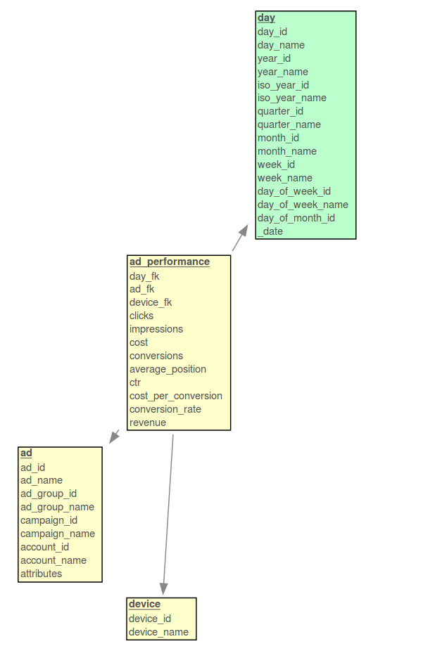

# Bing Ads Performance Pipeline

A small [mara data integration pipeline](https://github.com/mara/data-integration) that incrementally loads the files downloaded by the [mara Bing ads performance downloader](https://github.com/mara/bingads-performance-downloader) into a PostgreSQL data warehouse and transforms the data into a dimensional schema.


## Resulting data

The pipeline (defined in [bing_ads_performance_pipeline/__init__.py](bing_ads_performance_pipeline/__init__.py)) creates a database schema `ba_dim` that contains an `ad_performance` fact table with the dimensions `time`, `ad` and `device`:

 

&nbsp;

This is an example row of the fact table:

```sql
select * from ba_dim.ad_performance where conversions > 0 order by random() limit 1;
-[ RECORD 1 ]-------+---------------
day_fk              | 20180924
ad_fk               | 726354327458934
device_fk           | 1
clicks              | 36
impressions         | 31
cost                | 3.43
conversions         | 8
average_position    | 1.35
ctr                 | 53.02
cost_per_conversion | 0.43
conversion_rate     | 22.22
revenue             | 1802.56
```

See [Ad Performance Report](https://docs.microsoft.com/en-us/bingads/reporting-service/adperformancereportcolumn?view=bingads-12) for a documentation of the metrics.

&nbsp;


## Getting started

Add 

```
-e git+git@github.com:mara/bing-ads-performance-pipeline.git@1.0.0#egg=bing_ads_performance_pipeline
```

to the `requirements.txt` of your mara project. See the [mara example project](https://github.com/mara/mara-example-project) for details.
 
Make sure that your ETL contains the [etl_tools/create_time_dimensions/](https://github.com/mara/etl-tools/blob/master/etl_tools/create_time_dimensions/__init__.py) pipeline for creating the `time.day` dimension.

Then add the pipeline to your ETL with

```python
import bing_ads_performance_pipeline

my_pipeline.add(bing_ads_performance_pipeline.pipeline)
```
